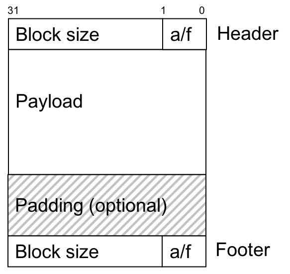

# OSH Lab 3   
**5-16更新**   
修复虽然write()没有截断文件，但offset+size后的文件内容均被清零的问题   
**5-13更新**   
- 默认文件系统总大小更改为512MB，块大小block size为4KB
- 现将文件信息列表头指针(`filenode_root`)保存在`mem[0]`所映射到的内存地址中
- 文件系统地址空间内存不足时`memfs_mm_alloc`返回-1并设置`errno`
- 修复写入时可能截断文件的bug

**文件系统总大小为4Mb，块大小block size为8 bytes**   
**本程序用到了`math.h`，因此需要使用`-lm`参数编译**   
完整的编译指令如下   
`gcc -D_FILE_OFFSET_BITS=64 -o oshfs oshfs.c -lfuse -lm`   
说明：
- 使用implicit free list + first fit管理文件系统地址空间，每次free时检查并合并可以合并的空闲块
- 每个块如果被allocate则用`mmap`映射到内存中，如果被free则用`munmap`释放空间
- 大文件如果文件系统地址空间没有大小足够的连续空闲块则分块存储，文件的内容（content）用链表的结构进行链接
- 文件系统地址空间空间不足时报错`no memory in memfs available.`
- `mmap`和`munmap`时error handling
- 支持`chmod`, `chown`操作

**implicit free list 每个块保存的信息**   
   
**测试通过下列命令**
- `ls`
- `touch`
- `echo >`
- `cat`
- `more`
- `nano`
- `vim`
- `chmod`
- `chown`
- `rm`
- `dd if=/dev/zero of=testfile bs=1M count=2`
    - `2097152 bytes (2.1 MB, 2.0 MiB) copied, 1.94881 s, 1.1 MB/s`
- `dd if=/dev/urandom of=testfile bs=1M count=1 seek=2`
    - `1048576 bytes (1.0 MB, 1.0 MiB) copied, 2.35701 s, 445 kB/s`
- `dd if=testfile of=/dev/null`
    - `3145728 bytes (3.1 MB, 3.0 MiB) copied, 0.0840754 s, 37.4 MB/s`